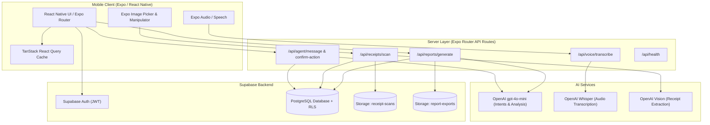
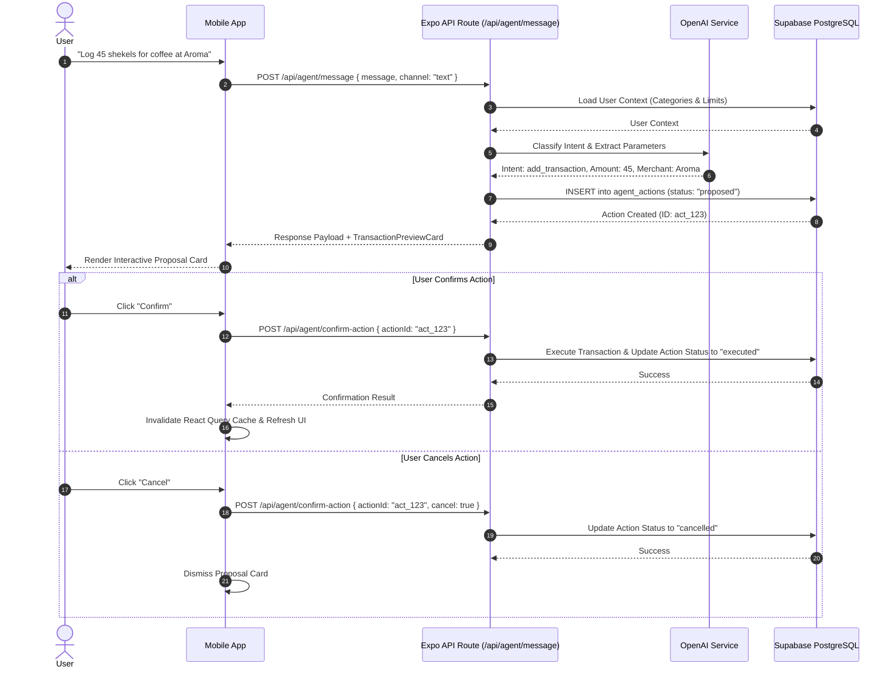

# BudgetPal

> **Agent-First Personal Finance Application**

BudgetPal is a full-stack, cross-platform personal finance application developed as a final B.Sc. capstone project. Built on an **agent-first architecture**, BudgetPal provides a conversational interface alongside visual dashboards, allowing users to log transactions, analyze spending patterns, check item affordability, set category limits, scan paper receipts, and generate financial reports using text, spoken audio, or photo uploads.

BudgetPal prioritizes deterministic financial calculations, validated structured outputs, transparent proposals, and explicit user confirmation before meaningful financial changes.

---

[](https://reactnative.dev/)
[](https://expo.dev/)
[](https://docs.expo.dev/router/introduction/)
[](https://www.typescriptlang.org/)
[](https://supabase.com/)
[](https://openai.com/)
[](https://tanstack.com/query/latest)
[](https://zod.dev/)

---

## Screenshots

Application screenshots and demo media are being prepared.

The current build includes the conversational agent, budget overview, transaction activity, receipt scanning, voice input, and report generation.

---

## Key Capabilities

* **Conversational Interaction:** Classifies natural language requests (`add_transaction`, `ask_spending_analysis`, `ask_affordability`, `ask_saving_advice`, `update_budget_limit`, `generate_report`) and renders corresponding UI cards.
* **Human-in-the-Loop Confirmation:** Financial operations require explicit user approval via interactive cards (`TransactionPreviewCard`, `BudgetLimitProposalCard`) before modifying database state.
* **Multimodal Receipt Extraction:** Accepts receipt images via camera capture or photo gallery selection, sending compressed payloads to a server-side vision pipeline (`gpt-4o-mini`) for structured data extraction.
* **Voice Recording Input:** Records audio locally using `expo-audio` with client-side RMS level detection, uploading completed audio files to OpenAI Whisper (`/api/voice/transcribe`) for transcription.
* **Deterministic Financial Analytics & Reports:** Calculates category totals, date ranges, and metrics server-side, generating vector PDF reports using `pdf-lib` (`/api/reports/generate`).
* **Localization Support:** Supports English and Hebrew localization strings (`en.json` and `he.json`) with an automated script to verify translation key parity.

---

## Why BudgetPal?

### The Problem
Traditional personal finance applications rely heavily on manual data entry and menu-driven navigation. Users must manually select categories, type line items, and navigate nested screens to track their finances. Over time, this friction leads to skipped entries and delayed awareness of overspending.

### The Agent-First Approach
BudgetPal places a conversational assistant at the primary entry point of the app:

```text
Traditional Workflow: User ──► Navigate Menus ──► Fill Manual Forms ──► Inspect Dashboard
BudgetPal Workflow:   User ──► State Intent (Text/Voice/Photo) ──► Agent Prepares Action ──► User Confirms
```

Instead of manually navigating forms, users can state their intent in natural language:
* *"I spent 45 shekels on lunch"*
* *"Can I afford headphones for 350 ILS?"*
* *"Show me my gas spending over the last 3 months"*
* *"Generate a monthly report"*

### Action Proposal Safeguards
AI interpretations are handled through an explicit state machine (`proposed` ──► `executed` / `cancelled`). When an action is proposed, an `agent_actions` record is created in a pending state, and the app presents an interactive card for review. The database transaction is executed only after the user confirms the action.

---

## Architecture

### High-Level System Overview



### Action Proposal & Confirmation Flow



---

## Tech Stack

| Category | Technology | Description |
| --- | --- | --- |
| **Mobile Core** | React Native `0.81.5`, Expo SDK `54`, Expo Router `6.0.24` | Cross-platform UI, file-based routing, and native module access |
| **Languages** | TypeScript `5.9`, SQL (PL/pgSQL), Node.js ES Modules | Type safety across client and server routes |
| **State & Data** | TanStack React Query `v5`, AsyncStorage, Zod `v4` | Data fetching, client caching, local storage, and runtime schema validation |
| **Backend** | Supabase (PostgreSQL), Expo Router API Routes | Database persistence, auth session handling, server-side route handlers |
| **AI Integration** | OpenAI API (`gpt-4o-mini`, `whisper-1`) | Intent classification, structured receipt extraction, and speech transcription |
| **Media & PDF** | `expo-audio`, `expo-speech`, `expo-image-picker`, `pdf-lib` | Local audio recording, text-to-speech synthesis, image picker, PDF rendering |
| **DevOps & Build** | EAS Hosting, EAS Build | Server route hosting (`web.output: "server"`) and native build profiles |

---

## Getting Started

### Prerequisites
* **Node.js:** v22.14.0 or higher
* **npm:** v10.0.0 or higher
* **Supabase Project:** Active Supabase instance with PostgreSQL database
* **OpenAI API Key:** Key with access to `gpt-4o-mini` and `whisper-1`

### Installation

1. **Clone the repository:**
   ```bash
   git clone https://github.com/b14ckPanther/BudgetPal.git
   cd BudgetPal
   ```

2. **Install dependencies:**
   ```bash
   npm install
   ```

3. **Configure environment variables:**
   Copy `.env.example` to `.env` and fill in the required keys:
   ```bash
   cp .env.example .env
   ```

4. **Apply database migrations:**
   Apply SQL migration files located in `supabase/migrations/` using the Supabase CLI or SQL Editor:
   ```bash
   supabase db push
   ```

---

## Environment Variables

| Variable Name | Scope | Required | Purpose |
| --- | --- | --- | --- |
| `EXPO_PUBLIC_SUPABASE_URL` | Public Client | Yes | HTTPS URL of the Supabase project instance. Included in client bundle. |
| `EXPO_PUBLIC_SUPABASE_ANON_KEY` | Public Client | Yes | Supabase anonymous API key. Client-safe; restricted by database RLS. |
| `EXPO_PUBLIC_API_BASE_URL` | Public Client | Yes (Release) | HTTPS base URL for server API routes in release builds. Dev falls back to Metro host. |
| `SUPABASE_SERVICE_ROLE_KEY` | Server-Only | Yes (Server) | Service role key for backend operations. **Must not be prefixed with `EXPO_PUBLIC_`.** |
| `OPENAI_API_KEY` | Server-Only | Yes (Server) | Secret API key for OpenAI model calls. **Must not be prefixed with `EXPO_PUBLIC_`.** |
| `REPORT_AI_MODEL` | Server-Only | Optional | Model override for narrative report summaries (default: `gpt-4o-mini`). |
| `RECEIPT_VISION_MODEL` | Server-Only | Optional | Model override for receipt vision extraction (default: `gpt-4o-mini`). |
| `DEMO_NOOR_PASSWORD` | Local Dev | Optional | Local password used by provisioning and testing scripts. |
| `STAGING_API_BASE_URL` | Local Dev | Optional | Target HTTPS origin override for staging smoke test scripts. |

---

## Running the Application

```bash
# Start Expo development server
npm run start

# Run on Android emulator / device
npm run android

# Run on iOS simulator
npm run ios

# Run web build
npm run web

# Code linting
npm run lint

# Validate locale dictionary key parity
npm run validate:locales
```

---

## Deployment

Staging API endpoints under `app/api` are exported using Expo Router server output (`web.output: "server"`) and deployed to EAS Hosting.

```bash
# Export web server bundle and deploy to preview environment
npx expo export --platform web
eas deploy --environment preview --non-interactive

# Production staging alias promotion
eas deploy --environment production --prod --alias=presentation --non-interactive
```

Native build profiles configured in `eas.json`:
* `presentation-android`: Generates an Android APK distribution build.
* `presentation-ios`: Generates an iOS store/TestFlight distribution build.

---

## Automation Scripts

| Command / Script | Path | Purpose |
| --- | --- | --- |
| `npm run demo-provision` | `scripts/demo-provision-noor.mjs` | Provisions a seeded presentation environment with baseline transactions. |
| `npm run demo-reset` | `scripts/demo-reset.mjs` | Clears demo entries and restores the baseline presentation state. |
| `npm run demo-validate` | `scripts/demo-validate.mjs` | Validates database integrity and transaction metrics for the demo state. |
| `npm run validate:locales` | `scripts/validate-locale-parity.mjs` | Verifies key parity between `en.json` and `he.json`. |
| `npm run smoke-test:staging` | `scripts/smoke-test-staging.mjs` | Runs end-to-end integration tests against target API endpoints. |
| `npm run validate:staging-pdf` | `scripts/validate-staging-pdf.mjs` | Validates server-side PDF generation and HTTP response headers on staging. |
| `npm run validate:presentation-build` | `scripts/validate-presentation-build.mjs` | Pre-flight check verifying environment variables before native builds. |

---

## Security Implementation

* **Environment Separation:** `OPENAI_API_KEY` and `SUPABASE_SERVICE_ROLE_KEY` are kept exclusively on server runtimes and are not included in compiled client bundles.
* **Row-Level Security (RLS):** Supabase migrations define Row-Level Security policies for user-owned financial data across application tables (`profiles`, `budgets`, `categories`, `transactions`, `receipts`, `voice_entries`, `agent_messages`, `agent_actions`, `reports`, `warnings`, `budget_events`).
* **Storage Bucket Access:** Storage policies on `receipt-scans` and `report-exports` restrict object reads and writes to path prefixes matching the authenticated user ID.
* **API Authentication:** Server API routes verify incoming `Authorization: Bearer <JWT>` tokens against Supabase Auth before processing requests.

---

<details>
<summary><strong>Project Structure Details</strong></summary>

```text
BudgetPal/
├── app/                        # Expo Router Navigation & Server API Routes
│   ├── (auth)/                 # Login, signup, and onboarding screens
│   ├── (tabs)/                 # Main tab navigation (agent, budget, activity, reports, profile)
│   ├── api/                    # Server-side API Routes (EAS Hosting)
│   │   ├── agent/              # Message processing and action confirmation endpoints
│   │   ├── auth/               # Server-side authentication helpers
│   │   ├── export/             # CSV transaction and account export endpoints
│   │   ├── health+api.ts       # Service health monitoring endpoint
│   │   ├── receipts/           # Receipt upload and vision OCR endpoint
│   │   ├── reports/            # Report generation and export endpoints
│   │   └── voice/              # Whisper audio transcription endpoint
│   ├── profile/                # Settings sub-screens
│   ├── reports/                # Report detail route
│   └── transaction/            # Transaction creation and detail routes
├── assets/                     # Icons, splash screens, and branding images
├── docs/                       # Project documentation
├── scripts/                    # Provisioning, validation, and smoke-testing tools
├── src/                        # Main Application Code
│   ├── components/             # React Native components (agent, cards, UI elements)
│   ├── hooks/                  # Custom React hooks
│   ├── lib/                    # Core utilities, financial aggregations, i18n, Supabase client
│   ├── locales/                # JSON dictionaries (en.json, he.json)
│   ├── server/                 # Server-side domain business logic and prompts
│   │   └── validation.ts       # Zod schemas for request/response payloads
│   ├── services/               # API client service layer
│   ├── theme/                  # Theme tokens, colors, typography, spacing
│   └── types/                  # TypeScript interface and database definitions
├── supabase/                   # Supabase configuration and migration SQL scripts
├── app.json                    # Expo project configuration
├── eas.json                    # EAS Build and Hosting profiles
├── package.json                # Project dependencies and script definitions
└── tsconfig.json               # TypeScript compiler configuration
```

</details>

---

## Roadmap

Potential future work will be documented as the project evolves.

---

## Contributing

This repository is primarily maintained as a capstone and portfolio project.
Issues and constructive feedback are welcome.

---

## License

This repository is currently provided for portfolio and educational review.
No separate open-source license has been declared.
